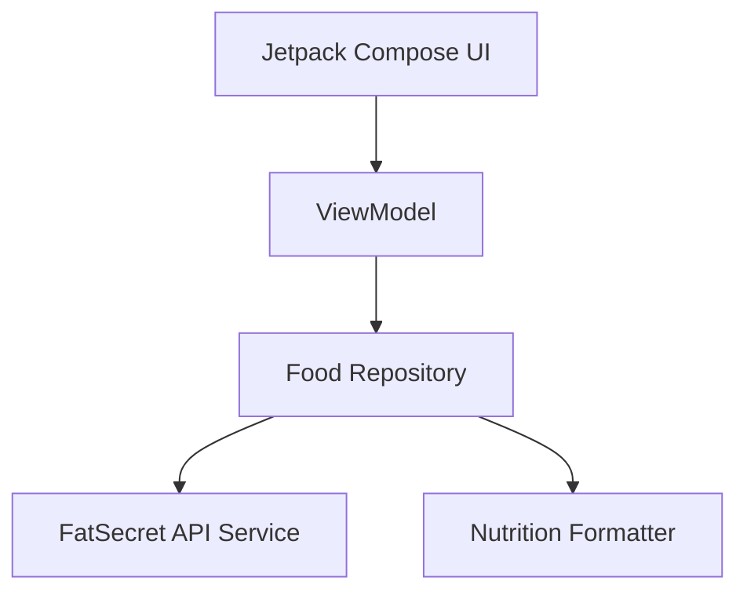

# 🍎 NomNom

NomNom is a modern, high-performance Android application designed for food discovery and nutritional tracking. Built with **Jetpack Compose** and following **Clean Architecture** principles, it provides users with a seamless experience for searching foods and discovering curated recipes with detailed nutritional insights.

[](https://www.android.com/)
[](https://kotlinlang.org/)
[](https://developer.android.com/jetpack/compose)

---

## ✨ Features

- 🔍 **Universal Search**: Find any food item with instant nutritional breakdowns.
- 👨‍🍳 **Curated Recipes**: Discover healthy and delicious recipes with step-by-step guides.
- 📊 **Nutrition Analysis**: Detailed tracking of Calories, Protein, Carbs, and Fats.
- 🚀 **Modern UI**: Fully built with Jetpack Compose and Material 3 for a fluid, premium feel.
- 🛡️ **Secure Architecture**: Abstracted secrets and production-hardened networking.

---

## 📸 Screenshots

<p align="center">
  
  
  
  
</p>

---

## 🏗️ Architecture & Tech Stack

This project follows **Clean Architecture** (UI -> ViewModel -> Repository -> Data Source) and uses a **TDD (Test-Driven Development)** workflow to ensure reliability.

### 🛠️ Core Technologies
- **UI Framework**: [Jetpack Compose](https://developer.android.com/jetpack/compose) with Material 3.
- **Dependency Management**: Gradle Version Catalog (libs.versions.toml).
- **Networking**: [Retrofit](https://square.github.io/retrofit/) & [OkHttp](https://square.github.io/okhttp/) with Logging Interceptor.
- **Asynchronous Flow**: Kotlin Coroutines & StateFlow.
- **Image Loading**: [Coil](https://coil-kt.github.io/coil/) (Coroutine Image Loader).
- **Testing**: [JUnit](https://junit.org/junit4/) & [MockK](https://mockk.io/) for robust unit testing.

### 📐 Structural Diagram


---

## 🚀 Getting Started

### Prerequisites
- Android Studio Jellyfish or newer.
- JDK 17.
- [FatSecret API](https://platform.fatsecret.com/) Credentials.

### Setup
1. Clone the repository.
2. Open `local.properties` and add your API keys:
   ```properties
   fatsecret.consumer.key=YOUR_CONSUMER_KEY
   fatsecret.consumer.secret=YOUR_CONSUMER_SECRET
   ```
3. Build and Run the app.

---

## 🧪 Running Tests

To run the unit test suite and verify architectural integrity:
```bash
./gradlew testDebugUnitTest
```

---

## 📜 License

This project is licensed under the MIT License - see the [LICENSE](LICENSE) file for details.

---

<p align="center">
  Made with ❤️ by Asphyxia & Antigravity
</p>
