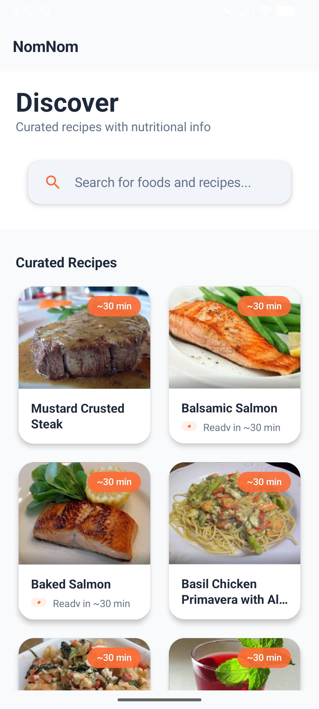
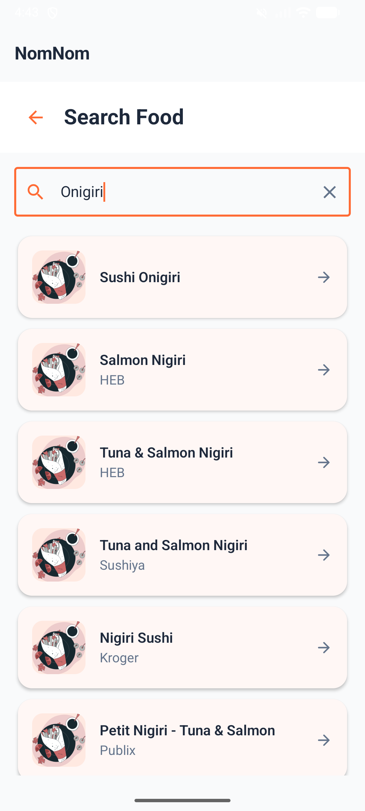
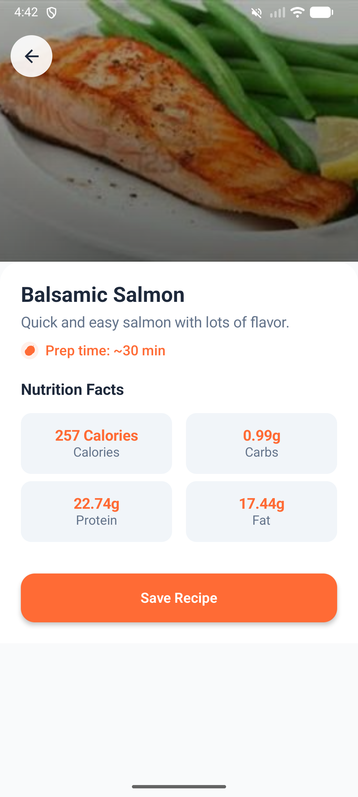
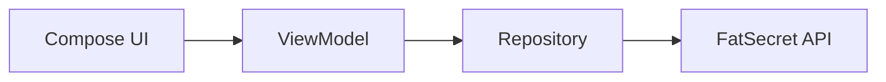

<p align="center">
  
</p>

# NomNom: Food & Recipes for Android

NomNom helps you find what's in your food. Search for ingredients, browse recipes, and get nutritional data without the fluff. Built with Jetpack Compose and a focus on clean, testable code.

[](https://www.android.com/)
[](https://kotlinlang.org/)
[](https://developer.android.com/jetpack/compose)

---

## What it does

- **Food Search**: Get calories, protein, carbs, and fats for almost anything.
- **Recipe Discovery**: A curated list of recipes with full nutritional breakdowns.
- **Clean UI**: No cluttered menus. Just a simple, Material 3 interface that gets out of your way.

---

## Screenshots

<p align="center">
  
  
  
  
</p>

---

## Tech Stack

I built this using a Clean Architecture approach to keep the UI separate from the data logic. It's easier to test and maintain this way.

- **Frontend**: Jetpack Compose with Material 3.
- **Networking**: Retrofit and OkHttp.
- **Architecture**: MVVM with a Repository pattern.
- **Images**: Coil for async image loading.
- **Testing**: JUnit and MockK (unit tests cover the repository and formatting logic).



---

## Getting Started

### 1. API Keys
You'll need a developer account at [FatSecret Platform](https://platform.fatsecret.com/). 

### 2. Configuration
Add your keys to `local.properties` in the root directory:
```properties
fatsecret.consumer.key=your_key_here
fatsecret.consumer.secret=your_secret_here
```

### 3. Build
Open in Android Studio (Jellyfish+) and hit run. Make sure you're using JDK 17.

---

## Development

The project follows a TDD workflow. You can run the tests with:
```bash
./gradlew test
```

---

Made by Asphyxia & Antigravity
